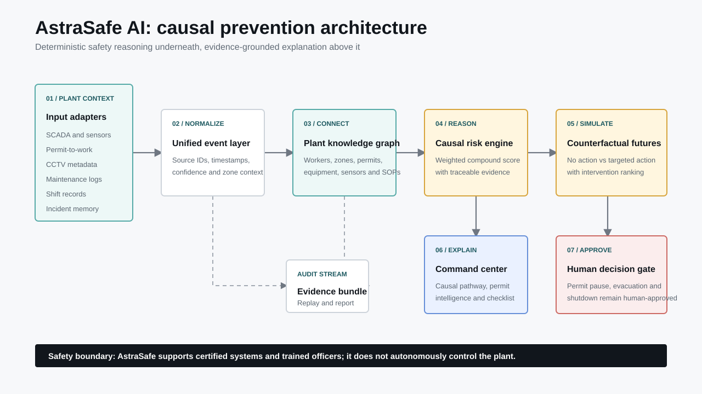
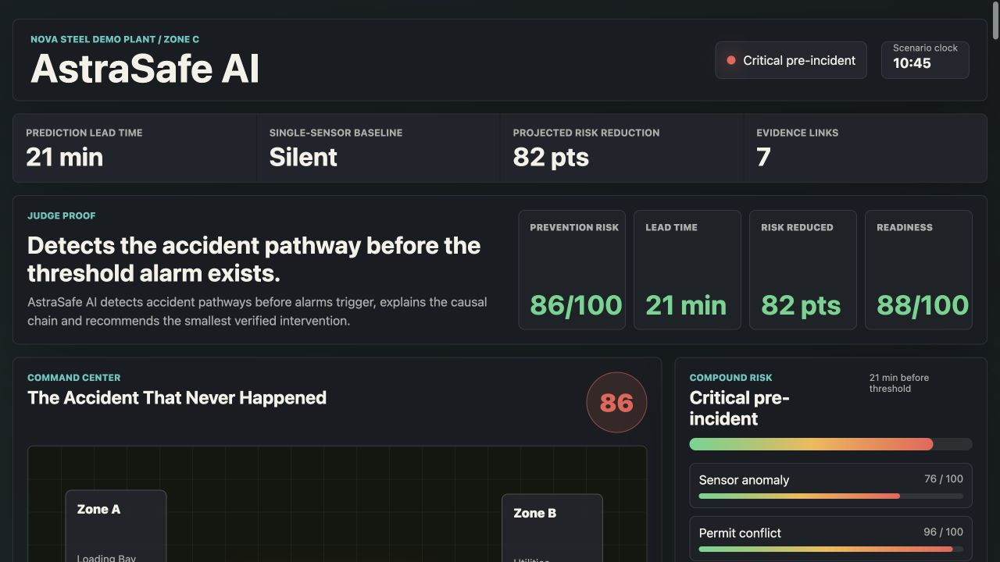

# AstraSafe AI - Causal Safety Twin





AstraSafe AI is a hackathon prototype for ET AI Hackathon 2.0 Problem Statement 1: AI-powered industrial safety intelligence for zero-harm operations.

The core thesis is simple: **accidents are chains, not moments**. AstraSafe connects weak signals across sensors, permits, workers, equipment, shift state and incident memory, detects a forming accident pathway before a traditional threshold alarm fires, and compares the future with and without intervention.

## Prototype Proof

| Evidence | Result |
| --- | ---: |
| AstraSafe alert | `10:45` |
| Traditional threshold alert | `11:06` |
| Prevention lead time | `21 minutes` |
| Critical pre-incident risk | `86/100` |
| No-action future | `100/100` |
| Recommended-action future | `18/100` |
| Projected risk reduction | `82 points` |

These are deterministic synthetic prototype results, not real-plant accuracy claims.

## Demo Scenario

The included scenario is **The Accident That Never Happened**:

- Gas Sensor G7 in Zone C begins rising but remains below the traditional alarm threshold.
- Ventilation Fan VF-2 is delayed in maintenance.
- Hot Work Permit HW-204 becomes active in the same zone.
- Three workers enter Zone C.
- A shift handover starts, reducing response availability.
- AstraSafe detects the compound pathway and recommends pausing the permit, evacuating Zone C and restoring VF-2.

## Run

```bash
npm run dev
```

Open `http://localhost:4173`.

For hosted environments:

```bash
npm start
```

## Test

```bash
npm test
```

## Architecture

AstraSafe is organized as an inspectable decision pipeline:

1. Normalize sensor, permit, worker, maintenance, shift and incident events.
2. Connect them through plant graph context.
3. Compute deterministic compound risk with traceable factors.
4. Simulate no-action and intervention futures.
5. Rank the smallest effective intervention.
6. Present the evidence to a safety officer for approval.
7. Preserve the decision trail in an evidence bundle.

See [docs/architecture.md](./docs/architecture.md) for module ownership and the production expansion path.

## What Is Implemented

- Deterministic synthetic plant simulator.
- Explainable compound risk engine using the weighted model from the project plan.
- Single-sensor baseline comparator.
- API-style snapshot endpoints for world state, risk, futures and reports.
- Permit intelligence that detects when a previously valid hot-work permit becomes unsafe after live context changes.
- Incident memory retrieval with near-miss and SOP matches.
- Live knowledge graph context that links workers, zones, permits, sensors, equipment and incident memory.
- Safety officer action checklist.
- Benchmark suite covering multiple compound-risk scenarios and baseline comparison.
- Submission readiness API mapping the prototype to hackathon judging criteria and deliverables.
- Pitch pack API and copyable demo brief for deck/video preparation.
- Timed demo recording plan for a 4-minute submission video.
- Evidence bundle API and export controls for audit-ready prevention evidence.
- Integration adapter contracts for SCADA, permits, CCTV metadata, maintenance, shifts and incident memory.
- Response orchestration workflow for safety officer approval, dispatch messages and evidence preservation.
- Safety governance model card covering intended use, limits, privacy, validation and production gates.
- Causal factor evidence with event IDs.
- Counterfactual future simulator for no-action and intervention futures.
- Intervention ranking based on projected risk reduction, response speed, confidence, reversibility and disruption.
- Prevention report generator with confirmed facts, predictions, recommended actions and uncertainty.
- Judge-facing command-center UI.

## Evaluation

The benchmark compares three systems across four deterministic synthetic scenarios:

| Comparator | Detection rate | Behavior |
| --- | ---: | --- |
| Single-sensor threshold | `75%` | Waits for an individual threshold breach. |
| Two-factor static rule | `75%` | Detects known pairs but misses broader context. |
| AstraSafe compound engine | `100%` | Connects causal signals across plant systems. |

Average lead time is `22 minutes` where a traditional threshold eventually fires. Average projected risk reduction is `57 points`. See [docs/evaluation_report.md](./docs/evaluation_report.md) for formulas, scenario-level results, limitations and reproduction steps.

## Innovation Boundary

AstraSafe does not claim that industrial safety AI is new. Its differentiated contribution is the combination of:

- Causal accident-pathway formation across disconnected plant systems.
- Counterfactual no-action versus intervention replay.
- Dynamic permit safety after a permit has already been issued.
- Evidence-linked intervention ranking with a human approval boundary.

The current prototype validates this system design with deterministic synthetic data. Production use requires real integrations, site calibration, domain-expert review and certified safety governance.

## API Endpoints

Use `step=6` to inspect the prevention moment.

```bash
curl http://127.0.0.1:4173/api/health
curl "http://127.0.0.1:4173/api/world/current?step=6"
curl "http://127.0.0.1:4173/api/risk/current?step=6"
curl "http://127.0.0.1:4173/api/futures/simulate?step=6"
curl "http://127.0.0.1:4173/api/intelligence/permit?step=6"
curl "http://127.0.0.1:4173/api/intelligence/memory?step=6"
curl "http://127.0.0.1:4173/api/graph/context?step=6"
curl "http://127.0.0.1:4173/api/reports/latest?step=6"
curl "http://127.0.0.1:4173/api/evidence/bundle?step=6"
curl "http://127.0.0.1:4173/api/integrations/adapters?step=6"
curl "http://127.0.0.1:4173/api/orchestration/response?step=6"
curl "http://127.0.0.1:4173/api/governance/model-card?step=6"
curl http://127.0.0.1:4173/api/evaluation/summary
curl http://127.0.0.1:4173/api/evaluation/benchmark
curl http://127.0.0.1:4173/api/submission/readiness
curl http://127.0.0.1:4173/api/submission/pitch-pack
curl http://127.0.0.1:4173/api/submission/recording-plan
```

## Safety Positioning

AstraSafe is a decision-support and prevention intelligence layer. It does not replace SCADA interlocks, certified safety systems or trained safety officers. In production, high-impact actions such as permit pause, evacuation and shutdown require human approval.

## Submission Assets

- `docs/demo_script.md` - narration and flow for the demo video.
- `docs/pitch_deck.md` - slide-by-slide content for the final deck.
- `docs/final_submission_checklist.md` - upload checklist for repository, demo, deck and deployed app.
- `docs/deployment_guide.md` - Render/local deployment steps and smoke checks.
- `docs/evaluation_report.md` - benchmark method, results and claim boundaries.
- `docs/assets/architecture.svg` - submission-ready architecture visual.
- `outputs/AstraSafe_AI_Hackathon_Pitch.pptx` - final presentation deck.
- `render.yaml` - Render web-service blueprint.
