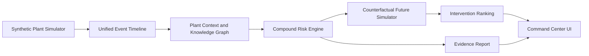

# AstraSafe Architecture

## Prototype Flow

## Current Modules

- `src/domain/scenario.js` contains the deterministic plant layout, event stream, graph facts and incident memory.
- `src/domain/risk-engine.js` computes compound risk, classifies alert state, simulates futures, ranks interventions and generates the prevention report.
- `src/app.js` turns the scenario into a judge-facing live command center.

## Production Expansion

The prototype is intentionally deterministic for hackathon trust. A production build would replace the synthetic timeline with adapters for SCADA, MQTT/Kafka sensor streams, permit-to-work systems, EHS documents and CCTV metadata. The LLM layer should remain an explanation and report layer, not the sole risk calculator.
