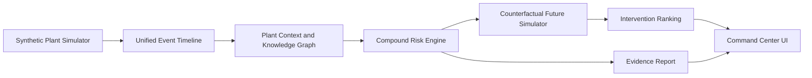

# AstraSafe Architecture

## Prototype Flow

## Current Modules

- `src/domain/scenario.js` contains the deterministic plant layout, event stream, graph facts and incident memory.
- `src/domain/risk-engine.js` computes compound risk, classifies alert state, simulates futures, ranks interventions and generates the prevention report.
- `src/domain/snapshot.js` builds the API-ready world snapshot shared by the dashboard and HTTP endpoints.
- `src/domain/intelligence.js` evaluates permit conflicts, retrieves incident/SOP memory and builds the safety officer checklist.
- `src/domain/graph-context.js` converts the plant relationship model into active causal paths and relationship evidence.
- `src/domain/benchmark.js` defines the multi-scenario evaluation benchmark used by the dashboard and API.
- `src/domain/submission.js` maps prototype evidence to hackathon judging criteria and deliverables.
- `src/domain/pitch-pack.js` generates the pitch brief, proof points and demo flow used by the dashboard and API.
- `src/domain/recording-plan.js` generates the timed storyboard for the 4-minute submission video.
- `src/app.js` turns the scenario into a judge-facing live command center.
- `server.js` serves the static prototype and exposes `/api/health`, `/api/world/current`, `/api/risk/current`, `/api/futures/simulate`, `/api/intelligence/permit`, `/api/intelligence/memory`, `/api/graph/context`, `/api/reports/latest`, `/api/evaluation/summary`, `/api/evaluation/benchmark`, `/api/submission/readiness`, `/api/submission/pitch-pack` and `/api/submission/recording-plan`.

## Production Expansion

The prototype is intentionally deterministic for hackathon trust. A production build would replace the synthetic timeline with adapters for SCADA, MQTT/Kafka sensor streams, permit-to-work systems, EHS documents and CCTV metadata. The LLM layer should remain an explanation and report layer, not the sole risk calculator.
